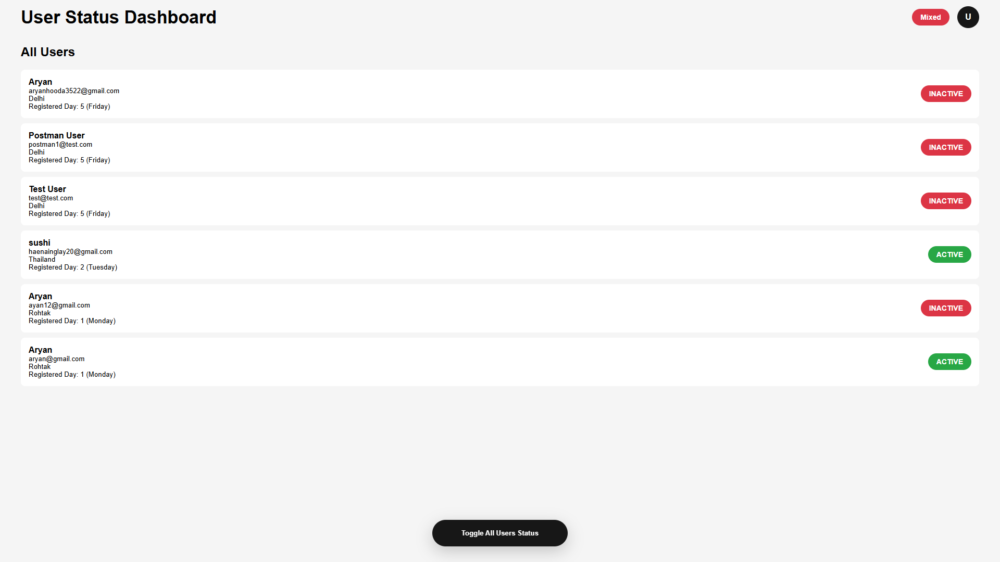
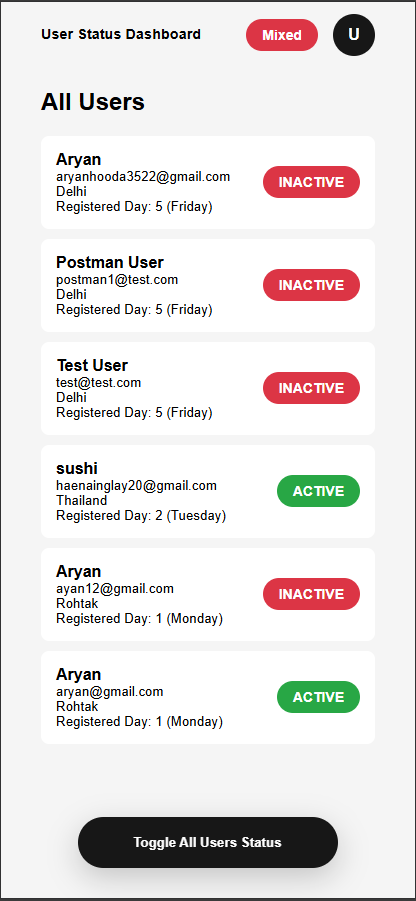

# 🔐 User Status Toggle API

A secure, production-ready REST API built with Node.js, Express.js, and MongoDB that enables authenticated users to perform bulk status operations across the entire user base.

<hr />

## 📸 Application Preview




## 📌 Overview

The User Status Toggle API demonstrates:

#### 🔐 Secure JWT authentication

#### ⚡ Optimized bulk database operations

#### 🧱 Scalable REST architecture

#### 🏗 Layered backend structure

#### 🤝 Open-source contribution readiness

The system allows authenticated users to toggle the status of all users in a single atomic operation using MongoDB bulk updates.

<hr />

## 🚀 Core Capabilities

#### ✅ User Registration

#### 🔑 Secure Login with JWT

#### 🔒 Password Hashing via bcrypt

#### 🛡 Protected Routes via Middleware

#### 🔄 Bulk Status Toggle (Active ↔ Inactive)

#### 📊 MongoDB Aggregation Support

#### 🧩 Clean Controller-Based Structure

#### ⚙️ Production-ready configuration model

<hr />

## 🧠 Bulk Toggle Logic

When the toggle endpoint is triggered:

If the majority of users are active → all users become inactive

If the majority of users are inactive → all users become active

✔ Executed via a single bulk update <br/>
✔ Optimized for scalability <br/>
✔ Designed for production reliability <br/>

<hr />

## 🏗 System Architecture

```text
Client
   │
   ▼
Express Router
   │
   ▼
Controller Layer
   │
   ▼
MongoDB (via Mongoose)
```

## 📁 Project Structure

```text
├── src/
│   ├── controllers/
│   ├── models/
│   ├── routes/
│   ├── middleware/
│   └── app.js
├── .env
├── package.json
└── README.md
```

<hr />

## 🛠 Technology Stack

| Layer          | Technology |
| -------------- | ---------- |
| Runtime        | Node.js    |
| Framework      | Express.js |
| Database       | MongoDB    |
| ODM            | Mongoose   |
| Authentication | JWT        |
| Security       | bcrypt     |

<hr />

## ⚙️ Installation & Setup

#### 1️⃣ Clone Repository
git clone https://github.com/your-username/Auth-Application.git <br/>
cd Auth-Application

#### 2️⃣ Install Dependencies
npm install

#### 3️⃣ Configure Environment Variables

#### Create a .env file in the root directory:
```text
PORT=5000
MONGO_URI=your_mongodb_uri
JWT_SECRET=super_secure_jwt_secret
```
#### 🔎 Environment Variables Explained

| Variable   | Description                                |
| ---------- | ------------------------------------------ |
| PORT       | Application runtime port                   |
| MONGO_URI  | MongoDB connection string (local or cloud) |
| JWT_SECRET | Secret key used for signing JWT tokens     |

#### 4️⃣ Start Application
npm start

###### Server will be available at:
http://localhost:5000

<hr />

## 🔗 API Endpoints

#### 📝 User Signup
```text
POST /api/auth/signup
{
  "email": "john@example.com",
  "password": "password123"
}
```
#### 🔐 User Login
```text
POST /api/auth/login
{
  "email": "john@example.com",
  "password": "password123"
}
```
Returns:
```text
{
  "token": "jwt_token_here"
}
```
#### ⚡ Toggle All Users Status

POST /api/users/toggle-status

Requires header:

Authorization: Bearer <jwt_token>

Performs a bulk update across all user records.

<hr />

## 🔒 Security Model

#### 🔐 Passwords hashed using bcrypt

#### 🛡 JWT secures protected routes

#### 🧠 Middleware validates tokens before controller execution

#### 🔑 Secrets stored only in environment variables

#### 🚫 No sensitive data stored in source code

<hr />

## 🧪 Expected Flow

User registers

User logs in → receives JWT

User calls protected toggle endpoint

All users’ statuses flip via bulk update

<hr />

## 📦 Production Considerations

Before deploying:

Use a strong JWT secret

Use a secure MongoDB URI

Enable HTTPS in production

Configure proper logging

Validate environment variables

Implement rate limiting (recommended)

Add input validation middleware

<hr />

## 🤝 Contributing

This repository is open to contributions.

You can contribute to:

#### 🚀 Backend performance improvements

#### 🔐 Security hardening

#### 🎨 UI enhancements

#### 🧪 Test coverage

#### 📦 DevOps improvements

#### 📘 Documentation clarity

#### 🧱 Architecture refactoring

## 📌 Contribution Workflow

#### 1️⃣ Fork the repository
#### 2️⃣ Create a feature branch
### git checkout -b feature/your-feature-name
#### 3️⃣ Implement changes
#### 4️⃣ Test thoroughly
#### 5️⃣ Submit a Pull Request
#### ✅ Production Validation Requirement

# Before submitting a PR:

## ✔ Ensure authentication flow works

## ✔ Ensure toggle logic remains correct

## ✔ Ensure no breaking API changes

## ✔ Test with a real MongoDB instance

## ✔ Confirm environment variables are not hardcoded

## ✔ Validate proper error handling

## ✔ Confirm no sensitive data exposure

# All contributions must maintain production stability.

## 📢 Opening Issues

Currently, there are no open issues.

If you would like to:

Improve UI

Enhance server logic

Add new features

Refactor architecture

Please open an issue first to discuss your proposal before implementation.

Collaborative discussion ensures consistency and quality.

<hr />

## 📈 Roadmap

Planned Improvements:

#### 🔄 Role-based Access Control (Admin/User)

#### 📊 Analytics Dashboard

#### 🧪 Unit & Integration Testing

#### 📘 Swagger / OpenAPI Documentation

#### 🐳 Docker Support

#### 🔁 CI/CD Pipeline Integration

#### 📡 Logging & Monitoring

#### 🛡 Rate Limiting & Security Enhancements

<hr />

## 👨‍💻 Maintainer

#### Aryan Hooda
#### Full Stack Developer | Software Engineer

<hr />

## ⭐ Support

If this project helps you:

Give it a ⭐ on GitHub.

Contributions, feedback, and architectural suggestions are welcome.
